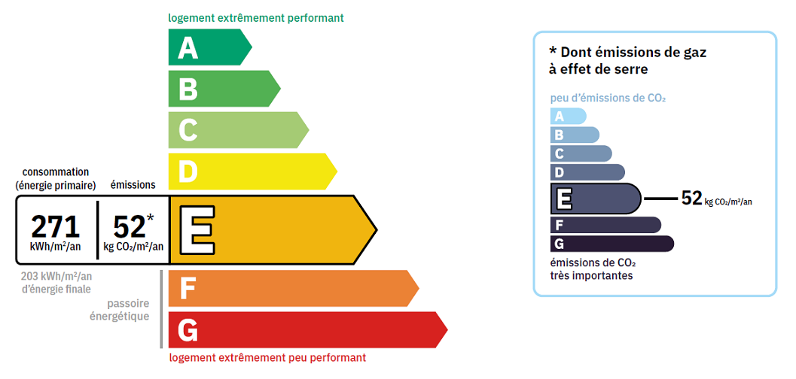

# DPE prediction challenge


More information can be found in the github repo https://github.com/AlexandreLarry1/datacamp22 and in the `starting_kit.ipynb` notebook.

# Context
Welcome to the DPE prediction challenge! 

Since 2006, the DPE score (Diagnostic de Performance Énergétique) was introduced as an evaluation of the energy consumption and the emission of greenhouse gas for any building or house. This score ranks the latter from A (most efficient) to G (least efficient) and is valid for 10 years. It is established based on official criteria such as heating and cooling capabilities, ventilation, etc.s

In 2021, establishing the DPE score became mandatory for every sale or letting of an apartment/house with certain properties behing forbidden from sale because of low DPE scores. In 2025 furthermore, the French government decided that most DPE scores were to be recalculated in accordance with new guidelines.

DPE scores are thus essential for property management but can only be delivered by certain certified entities. Hence, being able to anticipate such a rating proves to be valuable in anticipation of any sale/letting. It can also guide renovations to boost preparedness for future legislation.

# Data description
The data consists of numerical and categorical features of apartments throughout France with measurements in 2025. Features such as heat loss or type of heating are measured and can be correlated to the final DPE score of the property. As the data mixes numerical and categorical features, you will have to devise an **encoding** strategy for your model.

To help you evaluate your model locally, a small set of **test features** is provided for pre-testing (your submission will be evaluated on a separate private test).

# Task
Your task is to predict the `etiquette_dpe` class ranging from A to G. It is a **classification** task.

# Metric
As the aim of this challenge is to predict DPE scores for apartments throughout France, we need to develop a scoring metric to takes into account our categorical grades but also be inclined towards pessimistic models. Professionals would indeed prefer a model that is too pessimistic and delivers a below-relatity rating than the reverse as this could have substantial financial costs.

Your submissions will be evaluated using the **QWK (Quadratic Weighted Kappa)** metric. This metric is in range [-1,1] with the following interpretation : 
- -1 : complete disagreement between predictions and reality,
- 1 : complete agreement between predictions and reality,
- 0 : random agreement (i.e your model does not outperform a random model).

This metric was chosen because it **takes into account the distance between classes** and penalizes larger distances compared to other classification distances.


# Getting started
To test the ingestion program, run:

```bash
python ingestion_program/ingestion.py --data-dir dev_phase/input_data/ --output-dir ingestion_res/  --submission-dir solution/
```

To test the scoring program, run:
```bash
python scoring_program/scoring.py --reference-dir dev_phase/reference_data/ --output-dir scoring_res  --prediction-dir ingestion_res/
```
